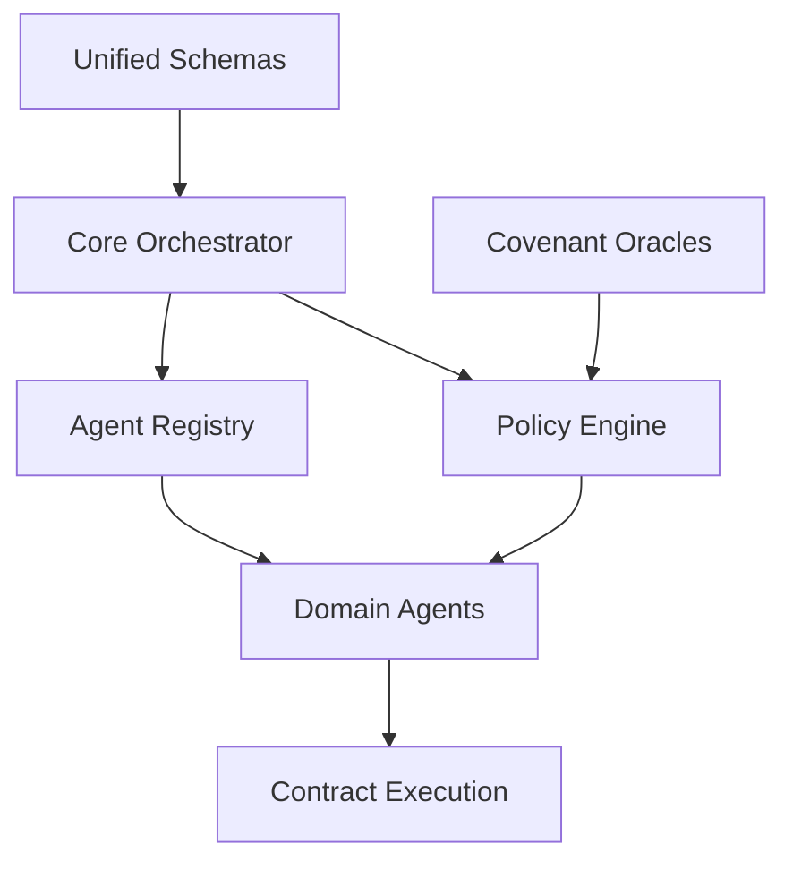

# 🗺️ DOMICILE COMPONENT MAPPING
## From Scattered Projects to Unified Architecture

**Purpose:** Map existing components to target Domicile architecture  
**Status:** Integration Planning Phase

---

## 📊 COMPONENT LOCATION MAP

### **🏗️ LAYER 1: Interface Layer**

| Component | Current Location | Target Location | Status | Notes |
|-----------|------------------|-----------------|--------|-------|
| **Builder Agent** | `openai-agents-js/builder-agent.ts` | `packages/interface/src/builder.ts` | ✅ Ready | Main contract builder |
| **YAML Processor** | `openai-agents-js/master-orchestrator-prompt.yaml` | `packages/interface/src/yaml-processor.ts` | 🔨 Needs wrapping | Enhancement area parser |
| **CLI Interface** | `openai-agents-js/src/orchestration/cli.ts` | `packages/interface/src/cli.ts` | ✅ Ready | Command line interface |
| **API Endpoints** | `openai-agents-js/backend/routes/` | `packages/interface/src/api/` | ✅ Ready | REST API routes |

### **🎛️ LAYER 2: Orchestration Layer**

| Component | Current Location | Target Location | Status | Notes |
|-----------|------------------|-----------------|--------|-------|
| **Main Orchestrator** | `openai-agents-js/src/orchestration/orchestrator.ts` | `packages/core/src/orchestrator.ts` | ✅ Ready | Core orchestration engine |
| **Policy Engine** | `openai-agents-js/src/orchestration/policy-engine.ts` | `packages/core/src/policy-engine.ts` | ✅ Ready | Governance enforcement |
| **Domain Classifier** | `openai-agents-js/src/orchestration/domain-detector.ts` | `packages/core/src/domain-classifier.ts` | ✅ Ready | Agent routing logic |
| **Agent Registry** | `openai-agents-js/src/orchestration/agent-registry.ts` | `packages/core/src/agent-registry.ts` | ✅ Ready | Agent catalog & trust |
| **Manifest Builder** | `openai-agents-js/src/orchestration/manifest-builder.ts` | `packages/core/src/manifest-builder.ts` | ✅ Ready | Contract compilation |
| **Covenant Runner** | `covenant-ai/packages/moat/src/runner.ts` | `packages/covenant/src/runner.ts` | 🔗 Needs integration | Trust enforcement |
| **Covenant Oracles** | `covenant-ai/packages/moat/oracles/` | `packages/covenant/src/oracles/` | 🔗 Needs integration | Purity, Integrity, Density |

### **⚡ LAYER 3: Execution Layer**

| Component | Current Location | Target Location | Status | Notes |
|-----------|------------------|-----------------|--------|-------|
| **Financial Agent** | `openai-agents-js/src/agents/financial/` | `packages/agents/src/financial/` | ✅ Ready | Multi-phase research |
| **Social Media Agent** | `openai-agents-js/examples/social-media-agent.ts` | `packages/agents/src/social-media/` | ✅ Ready | Content & engagement |
| **Research Agent** | `openai-agents-js/src/agents/research/` | `packages/agents/src/research/` | ✅ Ready | Triad graph RAG |
| **QVSCA Auditor** | `openai-agents-js/src/agents/qvsca-auditor.ts` | `packages/agents/src/qvsca/` | ✅ Ready | Quality assurance |
| **Base Domain Agent** | `openai-agents-js/src/agents/core/base-domain-agent.ts` | `packages/agents/src/core/` | ✅ Ready | Agent foundation class |

### **💾 LAYER 4: Data & Knowledge Layer**

| Component | Current Location | Target Location | Status | Notes |
|-----------|------------------|-----------------|--------|-------|
| **Pinecone Integration** | `openai-agents-js/src/orchestrator/pinecone-integration.ts` | `packages/data/src/vector-store.ts` | ✅ Ready | Semantic search |
| **Contract Storage** | `contracts/core/` | `packages/contracts/src/storage/` | 🔨 Needs integration | Schema definitions |
| **Knowledge Client** | `openai-agents-js/src/knowledge.client.ts` | `packages/data/src/knowledge-base.ts` | ✅ Ready | Knowledge management |
| **TrainPack Builder** | `openai-agents-js/src/trainpack.builder.ts` | `packages/data/src/training/` | ✅ Ready | QA pair generation |
| **Contract Schemas** | `contracts/examples/schema-generation/` | `packages/contracts/src/schemas/` | 🔨 Needs consolidation | TypeScript definitions |
| **Contract Templates** | `contracts/examples/` | `packages/contracts/src/templates/` | 🔨 Needs organization | Domain templates |

### **📊 LAYER 5: Observability Layer**

| Component | Current Location | Target Location | Status | Notes |
|-----------|------------------|-----------------|--------|-------|
| **Monitoring Dashboard** | `openai-agents-js/src/monitoring-dashboard.ts` | `packages/observability/src/dashboard.ts` | ✅ Ready | Real-time metrics |
| **Performance Optimizer** | `openai-agents-js/src/performance-optimizer.ts` | `packages/observability/src/performance.ts` | ✅ Ready | Optimization engine |
| **Audit Logger** | `openai-agents-js/src/orchestration/audit-logger.ts` | `packages/observability/src/audit.ts` | ✅ Ready | Decision tracing |
| **Health Checks** | `openai-agents-js/scripts/health-check.ts` | `packages/observability/src/health.ts` | ✅ Ready | System monitoring |

### **🚀 LAYER 6: Operations Layer**

| Component | Current Location | Target Location | Status | Notes |
|-----------|------------------|-----------------|--------|-------|
| **Deployment Scripts** | `openai-agents-js/scripts/` | `packages/operations/src/deployment/` | ✅ Ready | CI/CD automation |
| **Test Suites** | `openai-agents-js/tests/` | `packages/operations/src/testing/` | ✅ Ready | Quality assurance |
| **Configuration** | `openai-agents-js/eslint.config.mjs` etc. | `packages/operations/src/config/` | 🔨 Needs consolidation | Environment setup |
| **Runbooks** | `openai-agents-js/runbooks/` | `packages/operations/src/runbooks/` | ✅ Ready | Operational procedures |

---

## 🔗 DEPENDENCY RELATIONSHIPS

### **Critical Dependencies (Must Migrate First)**



### **Integration Order**

1. **Phase 1**: Schemas & Core (`packages/contracts`, `packages/core`)
2. **Phase 2**: Governance (`packages/covenant` → `packages/core`)
3. **Phase 3**: Agents (`packages/agents`)
4. **Phase 4**: Data Layer (`packages/data`)
5. **Phase 5**: Interface (`packages/interface`)
6. **Phase 6**: Operations (`packages/observability`, `packages/operations`)

---

## 📋 MIGRATION CHECKLIST

### **🔍 Pre-Migration Analysis**

```bash
#!/bin/bash
# scripts/analyze-components.sh

echo "🔍 Analyzing component dependencies..."

# Find all TypeScript imports
find openai-agents-js -name "*.ts" -exec grep -H "^import" {} \; > imports_analysis.txt

# Find external dependencies
find openai-agents-js -name "package.json" -exec cat {} \; | jq '.dependencies' > deps_openai.json
find contracts -name "package.json" -exec cat {} \; | jq '.dependencies' > deps_contracts.json
find covenant-ai -name "package.json" -exec cat {} \; | jq '.dependencies' > deps_covenant.json

# Analyze interface usage
grep -r "interface\|type" openai-agents-js/src --include="*.ts" | wc -l
echo "Total TypeScript definitions found"
```

### **📦 Package Migration Status**

| Package | Components | Complexity | Est. Time | Blocker Dependencies |
|---------|------------|------------|-----------|---------------------|
| `packages/contracts` | 12 schemas, 8 templates | Low | 0.5 days | None |
| `packages/core` | 6 orchestration files | High | 2 days | Unified schemas |
| `packages/covenant` | 4 oracles, 1 runner | Medium | 1 day | Core integration |
| `packages/agents` | 5 domain agents | Medium | 1.5 days | Core + Contracts |
| `packages/data` | 4 storage components | Low | 0.5 days | Contracts |
| `packages/interface` | 3 interface files | Low | 0.5 days | Core |
| `packages/observability` | 4 monitoring files | Low | 0.5 days | Core |
| `packages/operations` | Multiple scripts | Low | 1 day | All others |

---

## 🔧 MIGRATION AUTOMATION

### **Component Mover Script**

```bash
#!/bin/bash
# scripts/migrate-component.sh

COMPONENT=$1
SOURCE_PATH=$2
TARGET_PATH=$3

echo "🔄 Migrating $COMPONENT..."
echo "   From: $SOURCE_PATH"
echo "   To: $TARGET_PATH"

# Create target directory
mkdir -p $(dirname $TARGET_PATH)

# Copy component
cp -r $SOURCE_PATH $TARGET_PATH

# Update import paths
find $TARGET_PATH -name "*.ts" -exec sed -i '' 's|../\.\./\.\./|@domicile/|g' {} \;

# Validate TypeScript compilation
tsc --noEmit $TARGET_PATH/*.ts

if [ $? -eq 0 ]; then
    echo "✅ $COMPONENT migrated successfully"
else
    echo "❌ $COMPONENT migration failed - TypeScript errors"
    exit 1
fi
```

### **Import Path Fixer**

```bash
#!/bin/bash
# scripts/fix-imports.sh

echo "🔧 Fixing import paths for monorepo structure..."

# Define import mappings
declare -A IMPORT_MAP
IMPORT_MAP['"../orchestration/orchestrator"']='@domicile/core/orchestrator'
IMPORT_MAP['"../agents/']='@domicile/agents/'
IMPORT_MAP['"../contracts/']='@domicile/contracts/'
IMPORT_MAP['"../covenant/']='@domicile/covenant/'

# Apply mappings
for OLD_IMPORT in "${!IMPORT_MAP[@]}"; do
    NEW_IMPORT="${IMPORT_MAP[$OLD_IMPORT]}"
    echo "Replacing $OLD_IMPORT with $NEW_IMPORT"
    
    find packages -name "*.ts" -exec sed -i '' "s|$OLD_IMPORT|$NEW_IMPORT|g" {} \;
done

echo "✅ Import paths updated for monorepo"
```

---

## 🎯 VALIDATION STRATEGY

### **Component Validation Tests**

```typescript
// tests/integration/component-migration.test.ts

describe('Component Migration Validation', () => {
  describe('Layer 1: Interface', () => {
    it('should import and initialize builder agent', () => {
      const builder = new BuilderAgent();
      expect(builder).toBeDefined();
    });
  });

  describe('Layer 2: Orchestration', () => {
    it('should orchestrate end-to-end workflow', async () => {
      const orchestrator = new Orchestrator();
      const result = await orchestrator.processEnhancementAreas([]);
      expect(result).toBeDefined();
    });
  });

  describe('Layer 3: Execution', () => {
    it('should execute domain agents', async () => {
      const agent = new FinancialAgent();
      const contract = await agent.generateContract(mockArea);
      expect(contract).toMatchSchema(AgentContractSchema);
    });
  });

  // Continue for all layers...
});
```

### **Integration Health Check**

```bash
#!/bin/bash
# scripts/health-check-integration.sh

echo "🏥 Running integration health check..."

# Check package structure
echo "Checking package structure..."
for PACKAGE in core agents contracts covenant interface data observability operations; do
    if [ -d "packages/$PACKAGE" ]; then
        echo "✅ packages/$PACKAGE exists"
    else
        echo "❌ packages/$PACKAGE missing"
        exit 1
    fi
done

# Check build
echo "Checking build..."
pnpm build
if [ $? -eq 0 ]; then
    echo "✅ Build successful"
else
    echo "❌ Build failed"
    exit 1
fi

# Check tests
echo "Checking tests..."
pnpm test --passWithNoTests
if [ $? -eq 0 ]; then
    echo "✅ Tests passing"
else
    echo "❌ Tests failing"
    exit 1
fi

echo "🎉 Integration health check passed!"
```

---

## 📊 MIGRATION METRICS

### **Success Criteria**

- [ ] **Build Time**: < 30 seconds for full monorepo
- [ ] **Import Resolution**: 100% of imports resolve correctly
- [ ] **Test Coverage**: Maintain current test coverage levels
- [ ] **Performance**: Within 10% of current performance
- [ ] **Functionality**: All existing features work identically

### **Progress Tracking**

```bash
# Daily progress check
./scripts/migration-progress.sh

# Output:
# 🏗️ DOMICILE MIGRATION PROGRESS
# ===============================
# contracts:     ✅ 100% (12/12 components migrated)
# core:         🔄 75% (4/6 components migrated)
# covenant:     🔄 50% (2/4 components migrated)
# agents:       ⏳ 0% (0/5 components migrated)
# data:         ⏳ 0% (0/4 components migrated)
# interface:    ⏳ 0% (0/3 components migrated)
# observability: ⏳ 0% (0/4 components migrated)
# operations:   ⏳ 0% (0/8 components migrated)
# 
# Overall Progress: 32% (20/58 components)
```

---

**This mapping provides the blueprint for transforming your distributed genius into unified architecture. Each component has a clear destination and migration path.** 🗺️🚀