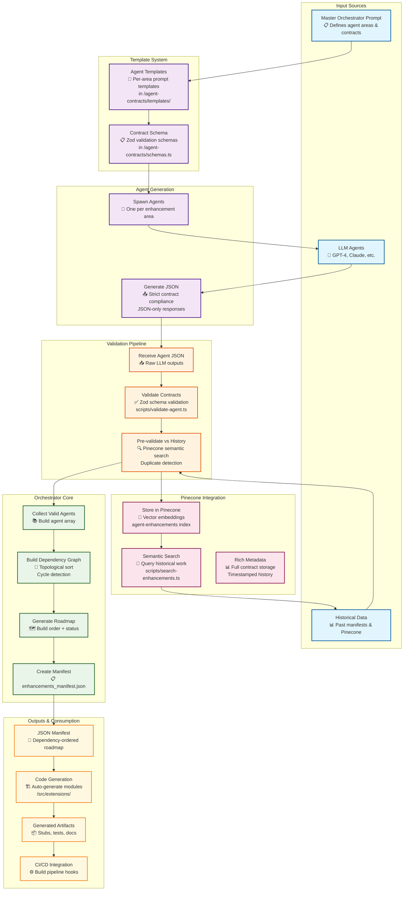

# Contract-Driven Multi-Agent Architecture

## Architecture Overview

This diagram shows the **Contract-Driven Multi-Agent System** with Pinecone integration:

### 🔄 **Core Flow**
1. **Master Prompt** → Defines agent areas and contract requirements
2. **Template System** → Provides structured prompts per enhancement area
3. **Agent Generation** → LLMs spawn one agent per area, outputting strict JSON
4. **Validation Pipeline** → Zod schema validation + semantic duplicate checking
5. **Orchestrator Core** → Builds dependency graph and creates manifest
6. **Pinecone Storage** → Stores all processed agents for future reference
7. **Code Generation** → Consumes manifest to auto-generate implementation stubs

### 🎯 **Key Features**
- **JSON-Only Discipline**: Agents return machine-readable contracts only
- **Semantic Validation**: Pinecone prevents duplicate work via vector search
- **DAG Integrity**: Topological sorting ensures dependency order
- **Self-Learning**: Historical data improves future validations
- **MCP Integration**: Clean Pinecone connectivity via Model Context Protocol

### 📊 **Data Flow**
- **Input**: Enhancement areas, historical data, LLM responses
- **Processing**: Validation, deduplication, dependency resolution
- **Storage**: Vector embeddings with rich metadata
- **Output**: Ordered manifest, generated code artifacts

### 🔧 **Entry Points**
- `pnpm validate` → Contract validation
- `pnpm orchestrate` → Full pipeline with Pinecone
- `pnpm search-enhancements` → Query historical work
- `pnpm setup-pinecone` → Initialize vector database
