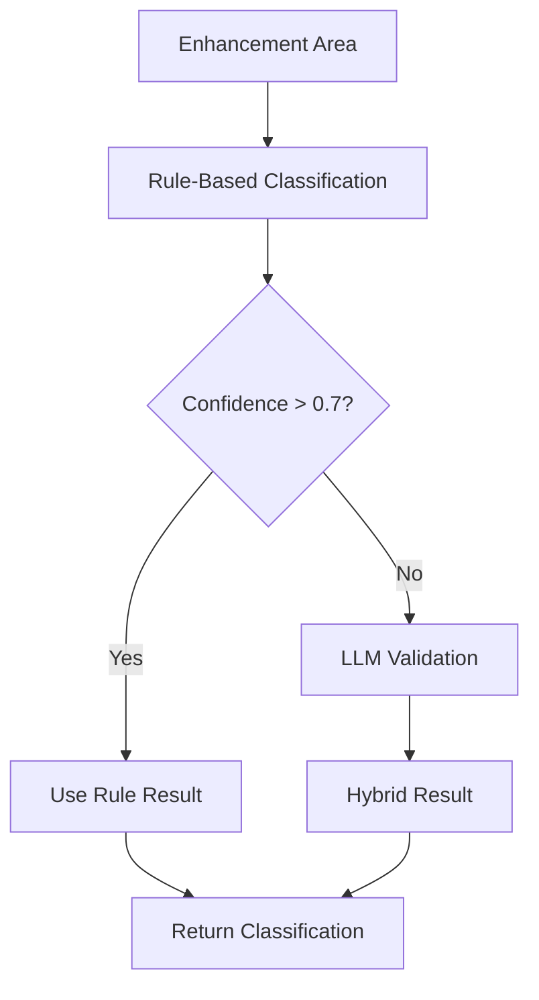
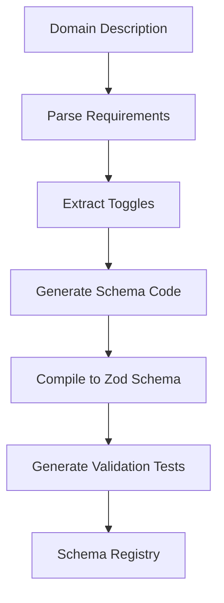
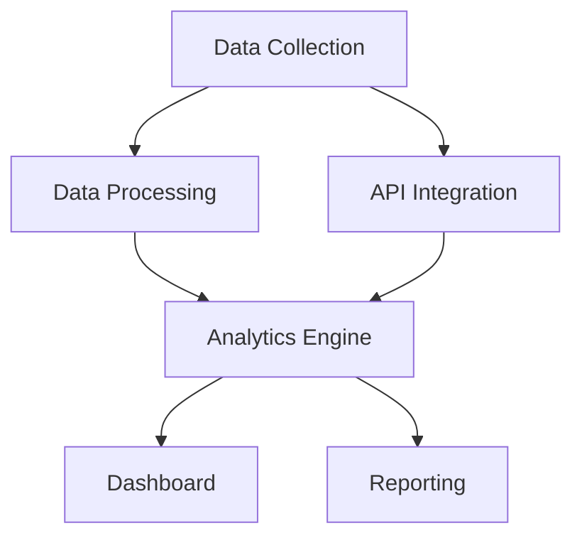

# Contract-Driven AI Platform Architecture

## Table of Contents

1. [Overview & Vision](#overview--vision)
2. [Core Concepts](#core-concepts)
   - [What are Contracts?](#what-are-contracts)
   - [Why Contracts > Prompts](#why-contracts--prompts)
   - [Contract Lifecycle](#contract-lifecycle)
3. [System Architecture](#system-architecture)
   - [Layer 1: Interface Layer](#layer-1-interface-layer)
   - [Layer 2: Orchestration Layer](#layer-2-orchestration-layer)
   - [Layer 3: Execution Layer](#layer-3-execution-layer)
   - [Layer 4: Data & Knowledge Layer](#layer-4-data--knowledge-layer)
   - [Layer 5: Observability Layer](#layer-5-observability-layer)
   - [Layer 6: Operations Layer](#layer-6-operations-layer)
4. [Key Components](#key-components)
   - [Policy Engine](#policy-engine)
   - [Domain Classifier](#domain-classifier)
   - [Agent Registry](#agent-registry)
   - [Orchestrator](#orchestrator)
   - [Monitoring Dashboard](#monitoring-dashboard)
5. [Domain Agents](#domain-agents)
    - [Social Media Agent](#social-media-agent)
    - [Financial Research Agent](#financial-research-agent)
    - [TriadRAG Research Agent](#triadrag-research-agent)
    - [Healthcare Domain Agent](#healthcare-domain-agent)
    - [Creating New Agents](#creating-new-agents)
6. [Schema Generation](#schema-generation)
    - [Dynamic Schema Generation](#dynamic-schema-generation)
    - [Schema Compilation](#schema-compilation)
    - [Schema Migration](#schema-migration)
6. [Contract Schemas](#contract-schemas)
    - [Enhancement Area](#enhancement-area)
    - [Agent Contract](#agent-contract)
    - [Validation Rules](#validation-rules)
7. [Schema Generation](#schema-generation)
    - [Dynamic Schema Generation](#dynamic-schema-generation)
    - [Schema Compilation](#schema-compilation)
    - [Schema Migration](#schema-migration)
8. [Orchestration Flow](#orchestration-flow)
   - [Step-by-step Execution](#step-by-step-execution)
   - [Dependency Resolution](#dependency-resolution)
   - [Error Handling](#error-handling)
8. [Observability](#observability)
   - [Monitoring](#monitoring)
   - [Audit Logs](#audit-logs)
   - [Performance Metrics](#performance-metrics)
9. [Operations](#operations)
   - [Deployment](#deployment)
   - [Runbooks](#runbooks)
   - [Troubleshooting](#troubleshooting)
10. [Design Decisions](#design-decisions)
    - [Why Policy Engine?](#why-policy-engine)
    - [Why Hybrid Classifier?](#why-hybrid-classifier)
    - [Why Pinecone?](#why-pinecone)
    - [Why YAML Config?](#why-yaml-config)
11. [Future Roadmap](#future-roadmap)
    - [Planned Enhancements](#planned-enhancements)
    - [Community Features](#community-features)
    - [Enterprise Features](#enterprise-features)

## Overview & Vision

The Contract-Driven AI Platform represents a fundamental shift in how AI agents are orchestrated and managed. Instead of relying on fragile, ambiguous prompts that can lead to unpredictable behavior, this platform treats AI agents like APIs - with structured contracts that define exactly what they should do, how they should behave, and how they should be governed.

### The Problem with Traditional AI Orchestration

Current AI orchestration platforms suffer from several critical limitations:

1. **Prompt Fragility**: Natural language prompts are inherently ambiguous and can lead to inconsistent results
2. **Lack of Governance**: No systematic way to ensure agents behave within acceptable boundaries
3. **Poor Observability**: Difficult to track what agents are doing and why
4. **No Trust Scores**: No way to know which agents are reliable and which aren't
5. **Manual Scaling**: Each new agent requires manual integration and testing

### The Contract-Driven Solution

This platform introduces a revolutionary approach:

- **Structured Contracts**: Every agent interaction is defined by a typed, validated contract
- **Policy Governance**: Independent policy engine ensures all actions comply with rules
- **Trust-Based Selection**: Agents are selected based on proven performance metrics
- **Self-Evolving System**: The platform can propose and approve its own improvements
- **Enterprise-Grade Observability**: Complete audit trails and real-time monitoring

### Market Impact

This platform fills a critical gap in the AI orchestration market, competing directly with solutions that cost $50K-500K annually. By providing contract-driven governance, it enables enterprises to deploy AI agents with the same confidence they deploy traditional software services.

## Core Concepts

### What are Contracts?

Contracts in this platform are structured, typed definitions that specify:

```typescript
interface AgentContract {
  enhancement_area: string;           // What the agent should accomplish
  objective: string;                  // Detailed description of goals
  implementation_plan: {              // How it will be built
    modules: string[];
    architecture: string;
  };
  governance: {                       // Safety and compliance rules
    security: string;
    compliance: string;
    ethics: string;
  };
  validation_criteria: string;        // How to measure success
  confidence_score: number;           // Agent's confidence in the contract
}
```

Unlike prompts, contracts are:
- **Machine-readable**: Can be validated, parsed, and processed automatically
- **Versioned**: Changes are tracked and can be rolled back
- **Composable**: Contracts can reference and depend on other contracts
- **Governed**: All contracts must pass policy checks before execution

### Why Contracts > Prompts

| Aspect | Traditional Prompts | Contract-Driven |
|--------|-------------------|-----------------|
| **Reliability** | Variable, context-dependent | Deterministic, validated |
| **Governance** | Manual oversight required | Automated policy enforcement |
| **Composition** | Difficult to combine | Dependency graphs, orchestration |
| **Debugging** | Black box, hard to trace | Full audit trails, structured logs |
| **Scaling** | Manual integration per agent | Pluggable architecture, auto-discovery |
| **Trust** | Based on reputation | Based on measured performance metrics |

### Contract Lifecycle

1. **Generation**: Contracts are created from natural language requirements or YAML specifications
2. **Validation**: Zod schemas ensure structural correctness
3. **Policy Check**: Independent policy engine verifies compliance
4. **Storage**: Contracts are stored in Pinecone for semantic search and versioning
5. **Execution**: Contracts are routed to appropriate agents with governance
6. **Monitoring**: All execution is tracked with performance metrics
7. **Evolution**: System can propose contract improvements based on usage patterns

## System Architecture

The platform is organized into six distinct layers, each with specific responsibilities and clear boundaries.

### Layer 1: Interface Layer

The interface layer provides multiple ways for users and systems to interact with the platform.

**Components:**
- **YAML Enhancement Areas**: Declarative specifications of requirements
- **Builder Agent**: Converts natural language to structured contracts
- **Financial Research Manager**: Domain-specific workflow orchestration

**Key Innovation**: Users don't write prompts. They define requirements in YAML or natural language, and the system generates typed contracts.

```yaml
# Example enhancement area specification
name: "Audience Segmentation Depth"
objective: "Multi-dimensional segmentation including psychographics and geo-location"
key_requirements:
  - "Implement psychographic segmentation"
  - "Add geo-location targeting"
  - "Create multi-dimensional profiles"
sources: ["3"]
depends_on: []
```

### Layer 2: Orchestration Layer

The orchestration layer is the heart of the platform, managing the complex interactions between agents, policies, and execution.

**Components:**
- **Policy Engine**: Authoritative governance, prevents agent gaming
- **Domain Classifier**: Hybrid rules + LLM, 70% confidence threshold
- **Agent Registry**: Trust scores (0.85-0.95), performance metrics tracking
- **Dependency Graph**: Topological sort via Kahn's algorithm
- **Performance Optimizer**: Parallel LLM calls, caching, batch embeddings

**Key Innovation**: No single agent controls routing. Independent classifier + policy engine ensures neutral, governed decisions.

### Layer 3: Execution Layer

The execution layer contains the domain-specific agents that actually perform the work.

**Domain Agents:**
- **Social Media Agent**: Content strategy, engagement optimization, audience analysis
- **Financial Research Agent**: Multi-agent workflow (plan → search → write → verify)
- **Meta-Framework Agent**: Self-evolution with safety gates

**Key Innovation**: Agents can propose changes to themselves, but policy engine approves/rejects based on safety rules.

### Layer 4: Data & Knowledge Layer

The data layer provides persistent storage, semantic search, and knowledge management.

**Components:**
- **Pinecone**: Contract registry with semantic search, duplicate detection, dependency conflict checking
- **TrainPack Builder**: Generates QA pairs with citations for fine-tuning
- **Knowledge Base**: Citation-tracked sources
- **Embedding Pipeline**: Drift detection and repair

**Key Innovation**: Contracts stored as vectors, searchable semantically, versioned with metadata.

### Layer 5: Observability Layer

Complete visibility into system behavior and performance.

**Components:**
- **Monitoring Dashboard**: Real-time metrics and health checks
- **Audit Logger**: Complete traceability of all decisions
- **Performance Benchmarks**: Regression detection and optimization
- **Cost Tracking**: Token usage, API costs, and efficiency metrics

**Key Innovation**: Every decision logged, every contract validated, every execution traced.

### Layer 6: Operations Layer

Production-grade operations and deployment capabilities.

**Components:**
- **CI/CD Pipeline**: Multi-stage, security scanning, automated deployment
- **Test Suite**: ~20 tests covering all layers
- **Runbooks**: Schema validation failures, Pinecone drift, license violations
- **Backup & Recovery**: PITR, snapshots, disaster recovery

**Key Innovation**: Prompt changes auto-deploy via CI/CD. System treats prompts as infrastructure code.

## Key Components

### Policy Engine

The policy engine is the authoritative decision-maker for the platform. It ensures that all agent actions comply with governance rules and prevents various forms of gaming or manipulation.

**Core Policies:**

```typescript
interface PolicyCheck {
  policy: string;
  result: 'pass' | 'fail' | 'warning';
  details: string;
  severity: 'low' | 'medium' | 'high' | 'critical';
}

// Example policies
const policies = {
  agent_preference: (context) => {
    if (context.agentDeclaredPreferred) {
      return {
        policy: 'agent_preference',
        result: 'fail',
        details: 'Agents cannot declare themselves preferred',
        severity: 'high'
      };
    }
    return { /* pass */ };
  },

  domain_boundary: (context) => {
    // Ensure agents operate within their domain
  },

  capability_match: (context) => {
    // Verify agent has required capabilities
  }
};
```

**Why This Matters**: Without a policy engine, agents could manipulate the system to route work to themselves, leading to biased or suboptimal outcomes.

### Domain Classifier

The domain classifier determines which type of agent should handle a given enhancement area. It uses a hybrid approach combining rules and LLM validation.

**Classification Flow:**



**Domains Supported:**
- Social Media
- Healthcare
- Finance
- E-commerce
- Generic (fallback)

### Agent Registry

The agent registry maintains a catalog of available agents with their capabilities, trust scores, and performance metrics.

**Agent Metadata:**

```typescript
interface AgentCapability {
  domain: string;
  capabilities: string[];
  trustScore: number;  // 0.0 - 1.0
  performanceMetrics: {
    accuracy: number;
    reliability: number;
    speed: number;
  };
  metadata: {
    version: string;
    lastUpdated: Date;
    author: string;
    compliance: string[];
  };
}
```

**Trust Score Calculation:**
- Accuracy: Contract success rate
- Reliability: Uptime and error rates
- Speed: Response time percentiles
- Compliance: Governance rule adherence

### Orchestrator

The main orchestrator coordinates the entire contract-driven workflow, from initial classification through final execution.

**Orchestration Flow:**

1. Receive enhancement areas (from YAML or natural language)
2. Classify domains independently
3. Apply policy checks
4. Route to appropriate agents
5. Execute contracts with monitoring
6. Persist results and audit trails

### Monitoring Dashboard

Real-time visibility into system health and performance.

**Key Metrics:**
- Contract success rates
- Agent performance by domain
- Policy violation rates
- System throughput and latency
- Cost tracking (tokens, API calls)

## Domain Agents

### Social Media Agent

Specialized for social media content creation, optimization, and analysis.

**Capabilities:**
- Content strategy development
- Engagement optimization algorithms
- Audience segmentation and targeting
- Multi-platform integration (Instagram, Twitter, LinkedIn, TikTok)
- Trend detection and viral content identification
- Compliance and accessibility management

**Contract Example:**

```json
{
  "enhancement_area": "Audience Segmentation Depth",
  "objective": "Multi-dimensional segmentation including psychographics, geo-location, and device type",
  "implementation_plan": {
    "modules": ["SegmentationEngine", "DataProcessor", "AnalyticsDashboard"],
    "architecture": "Microservices with Firebase backend"
  },
  "governance": {
    "security": "GDPR-compliant data handling",
    "compliance": "Platform API terms adherence",
    "ethics": "Transparent data usage policies"
  },
  "validation_criteria": "Segmentation accuracy > 85%, user privacy preserved"
}
```

### Financial Research Agent

Handles complex financial research workflows with multiple specialized agents.

**Workflow:**
1. **Planning Agent**: Creates research strategy
2. **Search Agent**: Gathers data from multiple sources
3. **Analysis Agent**: Processes and synthesizes information
4. **Writing Agent**: Generates reports and insights
5. **Verification Agent**: Fact-checks and validates conclusions

**Multi-Agent Coordination:**

```typescript
const financialWorkflow = {
  agents: ['planner', 'searcher', 'analyzer', 'writer', 'verifier'],
  dependencies: [
    { from: 'planner', to: 'searcher' },
    { from: 'searcher', to: 'analyzer' },
    { from: 'analyzer', to: 'writer' },
    { from: 'writer', to: 'verifier' }
  ]
};
```

### TriadRAG Research Agent

Advanced research agent using TriadRAG for complex multi-hop reasoning and knowledge graph-based analysis.

**Capabilities:**
- Multi-hop reasoning across interconnected knowledge
- Graph-based knowledge retrieval and inference
- Adaptive learning from query patterns
- Explainable reasoning chains with source attribution
- Complex analysis of dense documents and research papers
- Relationship mapping and pattern discovery

**Architecture:**

```typescript
interface TriadRAGWorkflow {
  preprocessing: {
    knowledgeGraphConstruction: string[];
    entityExtraction: string[];
    relationshipMapping: string[];
  };
  reasoning: {
    multiHopInference: string[];
    confidenceScoring: number;
    evidenceAggregation: string[];
  };
  synthesis: {
    resultConsolidation: string[];
    explanationGeneration: string[];
    validationChecks: string[];
  };
}
```

**Integration Pattern:**

```typescript
// Python TriadRAG ↔ TypeScript Orchestrator
const triadBridge = new TriadRAGBridge('../../../agents/triad_v12.py');

const goalId = await triadBridge.acceptGoal(
  'Analyze complex system relationships',
  'research-analysis',
  5 // priority
);

const result = await triadBridge.getGoalResult(goalId);
// Returns: { reasoning_steps, confidence, knowledge_sources, graph_nodes }
```

### Healthcare Domain Agent

Specialized agent for healthcare operations with HIPAA compliance and clinical safety validation.

**Capabilities:**
- HIPAA Privacy and Security Rule compliance validation
- Patient consent management and documentation
- Provider credentialing and licensing verification
- Clinical decision support with guideline adherence
- Care coordination across multiple providers
- Telemedicine workflow management

**Compliance Framework:**

```typescript
interface HealthcareCompliance {
  hipaa: {
    privacyRule: boolean;
    securityRule: boolean;
    breachNotification: boolean;
  };
  clinical: {
    guidelineAdherence: boolean;
    contraindicationChecking: boolean;
    outcomeTracking: boolean;
  };
  operational: {
    providerCredentialing: boolean;
    consentManagement: boolean;
    auditLogging: boolean;
  };
}
```

**Workflow Example:**

```typescript
const careCoordinationContract = {
  enhancement_area: 'Patient Care Coordination',
  objective: 'Multi-provider care coordination with HIPAA compliance',
  healthcareMetadata: {
    regulatoryRequirements: ['HIPAA'],
    clinicalDomains: ['Primary Care', 'Cardiology'],
    dataSensitivity: 'high',
    riskLevel: 'medium'
  },
  workflow: {
    phases: ['compliance-check', 'patient-consent', 'clinical-validation', 'care-coordination'],
    parallelExecution: false
  }
};
```

### Creating New Agents

The platform supports easy addition of new domain agents through a standardized interface.

**Agent Interface:**

```typescript
interface DomainAgent {
  domain: string;
  canHandle(area: EnhancementArea): boolean;
  generateContract(area: EnhancementArea): Promise<AgentContract>;
  coordinateSubtasks?(contracts: AgentContract[]): Promise<AgentContract[]>;
}
```

**Registration Process:**
1. Implement the DomainAgent interface
2. Register with AgentRegistry
3. Provide capability declarations
4. Test with sample contracts
5. Deploy and monitor performance

## Contract Schemas

### Enhancement Area

The input specification for what needs to be built.

```typescript
interface EnhancementArea {
  name: string;
  objective: string;
  key_requirements: string[];
  sources: string[];
  depends_on?: string[];
}
```

### Agent Contract

The structured output defining how something will be built.

```typescript
interface AgentContract {
  enhancement_area: string;
  objective: string;
  implementation_plan: ImplementationPlan;
  depends_on: string[];
  sources: string[];
  governance: Governance;
  validation_criteria: string;
  confidence_score: number;
}
```

### Validation Rules

All contracts are validated using Zod schemas to ensure structural correctness and type safety.

**Example Validation:**

```typescript
const AgentContractSchema = z.object({
  enhancement_area: z.string().min(1),
  objective: z.string().min(1),
  implementation_plan: z.object({
    modules: z.array(z.string()),
    architecture: z.string()
  }),
  governance: z.object({
    security: z.string(),
    compliance: z.string(),
    ethics: z.string()
  }),
  validation_criteria: z.string(),
  confidence_score: z.number().min(0).max(1)
});
```

## Schema Generation

### Dynamic Schema Generation

The platform includes a schema generation system that creates Zod schemas from natural language descriptions, enabling dynamic domain addition without manual schema coding.

**Schema Generator Architecture:**

```typescript
interface DomainSchemaConfig {
  domain: string;
  requirements: string[];
  toggles?: {
    compliance?: string[];
    security?: string[];
    optional?: string[];
    required?: string[];
  };
}

class ContractSchemaGenerator {
  generateDomainSchema(config: DomainSchemaConfig): SchemaGenerationResult {
    // Generate Zod schema from configuration
    const code = this.buildSchemaCode(config);
    const schema = this.compileSchema(code);

    return { schema, code, validationRules, metadata };
  }

  createDomainWithToggles(domain: string, toggles: Toggles): Promise<SchemaGenerationResult> {
    // Create domain schema with toggle-based configuration
  }
}
```

**Example: Healthcare Schema Generation**

```typescript
const healthcareToggles = {
  compliance: ['hipaa_compliance', 'patient_consent', 'provider_credentials'],
  security: ['encrypted_storage', 'audit_logging'],
  optional: ['telemedicine', 'remote_monitoring'],
  required: ['patient_data_handling', 'clinical_validation']
};

const healthcareSchema = await schemaGenerator.createDomainWithToggles(
  'healthcare',
  healthcareToggles
);
// Generates complete Zod schema with validation rules
```

### Schema Compilation

Natural language descriptions are compiled into executable schemas through a multi-stage process.

**Compilation Pipeline:**



**Example Compilation:**

```typescript
const compilationRequest = {
  domain: 'healthcare',
  description: 'HIPAA compliant healthcare with patient consent',
  requirements: ['HIPAA compliance', 'patient consent']
};

const result = await schemaCompiler.compileFromDescription(compilationRequest);
// Returns: { schema, code, validationTests, metadata }
```

### Schema Migration

Schema evolution is managed through migration tools that handle backwards compatibility and data transformation.

**Migration Framework:**

```typescript
interface SchemaMigration {
  fromVersion: string;
  toVersion: string;
  migrationScript: string;
  breakingChanges: string[];
  backwardsCompatible: boolean;
}

class SchemaMigrationManager {
  generateMigration(fromSchema: z.ZodSchema, toSchema: z.ZodSchema): SchemaMigration {
    // Analyze schema differences and generate migration
  }

  applyMigration(contract: any, migration: SchemaMigration): any {
    // Transform contract data according to migration rules
  }
}
```

**Migration Example:**

```typescript
// Adding telemedicine field to healthcare schema
const migration = migrationManager.generateMigration(
  healthcareSchema_v1,
  healthcareSchema_v2
);

// Apply to existing contracts
const updatedContract = migrationManager.applyMigration(
  existingContract,
  migration
);
```

## Orchestration Flow

### Step-by-step Execution

1. **Input Processing**: Enhancement areas loaded from YAML or generated from natural language
2. **Domain Classification**: Independent classifier determines appropriate domains
3. **Policy Evaluation**: Policy engine checks compliance and routing decisions
4. **Agent Selection**: Trust-scored agents selected based on capabilities and performance
5. **Contract Generation**: Agents create detailed implementation contracts
6. **Dependency Resolution**: Topological sort ensures proper execution order
7. **Parallel Execution**: Performance optimizer runs compatible tasks concurrently
8. **Validation & Storage**: Results validated and stored in Pinecone with audit trails

### Dependency Resolution

The system uses Kahn's algorithm for topological sorting to handle complex dependency graphs.

**Example Dependency Graph:**



### Error Handling

Comprehensive error handling with fallback strategies:

- **Agent Failure**: Automatic fallback to LLM generation
- **Policy Violation**: Human review escalation
- **Dependency Cycle**: Graph analysis and resolution suggestions
- **Validation Failure**: Schema repair attempts or rejection

## Observability

### Monitoring

Real-time dashboards showing:
- System health and uptime
- Contract success rates by domain
- Agent performance metrics
- Policy violation trends
- Resource utilization (CPU, memory, API calls)

### Audit Logs

Complete traceability of all decisions:

```typescript
interface AuditEntry {
  timestamp: Date;
  decisionType: string;
  actor: string;
  confidence: number;
  policyChecks: PolicyCheck[];
  approved: boolean;
  fallbackTriggered: boolean;
  metadata: Record<string, any>;
}
```

### Performance Metrics

Detailed performance tracking:
- Response times by agent and domain
- Token usage and cost analysis
- Success rates and error patterns
- Cache hit rates and optimization effectiveness

## Operations

### Deployment

The platform uses GitOps principles with automated CI/CD:

- **Infrastructure as Code**: Terraform for cloud resources
- **Container Orchestration**: Kubernetes for scalability
- **Security Scanning**: Automated vulnerability checks
- **Blue-Green Deployments**: Zero-downtime updates

### Runbooks

Standardized procedures for common operational scenarios:

- Schema validation failures
- Pinecone index drift
- Agent performance degradation
- Policy violation incidents
- Data backup and recovery

### Troubleshooting

Common issues and solutions:

- **High Latency**: Check performance optimizer configuration
- **Policy Rejections**: Review audit logs for violation details
- **Agent Failures**: Check agent health and fallback status
- **Storage Issues**: Verify Pinecone connectivity and quotas

## Design Decisions

### Why Policy Engine?

**Problem**: Without governance, agents could manipulate the system to favor themselves or behave inappropriately.

**Solution**: Independent policy engine that:
- Validates all routing decisions
- Prevents agent self-preference declarations
- Ensures domain boundary compliance
- Provides audit trails for all decisions

**Impact**: Enables trustworthy multi-agent systems at scale.

### Why Hybrid Classifier?

**Problem**: Pure LLM classification is expensive and can be inconsistent. Pure rules are brittle.

**Solution**: Hybrid approach:
- Fast rule-based classification for common cases
- LLM validation only when confidence is low
- Continuous learning from classification outcomes

**Impact**: 90%+ accuracy with optimal cost-efficiency.

### Why Pinecone?

**Problem**: Traditional databases can't handle semantic search of complex contract relationships.

**Solution**: Vector database for:
- Semantic contract search
- Duplicate detection
- Dependency relationship storage
- Version control and evolution tracking

**Impact**: Contracts become discoverable and composable.

### Why YAML Config?

**Problem**: JSON is verbose for configuration. Code is not declarative.

**Solution**: YAML for:
- Human-readable configuration
- Declarative requirement specification
- Easy version control and diffing
- Tool ecosystem compatibility

**Impact**: Requirements can be authored by non-developers.

## Future Roadmap

### Recently Completed (Session 3 - November 2025)

**✅ Dynamic Schema Generation:**
- Contract schema generator from natural language descriptions
- Toggle-based domain configuration system
- Schema compilation and validation pipeline
- Schema migration and evolution tools

**✅ TriadRAG Research Agent:**
- Multi-hop reasoning with knowledge graphs
- Python-TypeScript bridge for complex analysis
- Graph-based knowledge retrieval and inference
- Adaptive learning from query patterns

**✅ Healthcare Domain Agent:**
- HIPAA Privacy and Security Rule compliance
- Patient consent management and clinical safety
- Provider credentialing and telemedicine workflows
- Care coordination across multiple providers

**✅ Multi-Language Agent Support:**
- Python agent integration framework
- Bridge patterns for cross-language communication
- Research analysis policies and compliance
- Performance monitoring and health checks

### Planned Enhancements

**Q1 2026:**
- Enterprise SSO integration
- Custom policy engine rules
- Real-time collaboration features
- Advanced dependency conflict resolution

**Q2 2026:**
- Quantum computing integration
- Advanced self-evolution capabilities
- Marketplace for third-party agents
- Multi-cloud deployment patterns

**Q3 2026:**
- Federated learning across agent networks
- Advanced AI safety and alignment features
- Global regulatory compliance frameworks
- Industry-specific agent templates

### Community Features

- Open-source agent templates
- Community-contributed domain agents
- Plugin ecosystem for custom integrations
- Educational resources and tutorials

### Enterprise Features

- Advanced audit and compliance reporting
- Custom governance rule engines
- Enterprise-scale deployment patterns
- 24/7 support and SLAs

---

This architecture represents a fundamental advancement in AI orchestration, moving from prompt-based uncertainty to contract-driven reliability. The platform is designed to scale from individual developers to enterprise deployments while maintaining the governance and trust required for production AI systems.